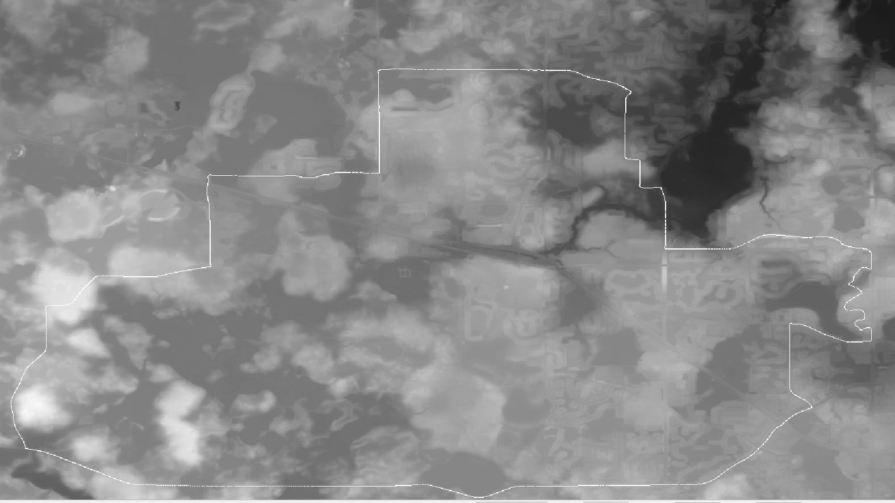

# GeoRide Simulator

A simulator for riding real-world geospatial terrain on a smart bike trainer.. 

<!--This platform maps real-world GPS tracks (such as Strava routes) directly onto underlying Digital Elevation Models (DEMs) to dynamically simulate real-world topography.-->



<!--## Features

- **Geospatial Processing**: Parsed high-resolution TIFF elevation maps using the [GDAL Library](https://gdal.org/).
- **Coordinate Mapping**: Real-time conversion of Latitude/Longitude coordinates to raster pixel arrays via inverse geotransforms.
- **Track Overlay**: Seamlessly projection of Strava GPS track profiles onto native terrain databases.
- **Dynamic Simulation**: Ready to translate elevation grade profiles into smart trainer resistance commands.

## Architecture & Project Structure

The project incorporates a clean C++ encapsulation framework to split data reading from manipulation:

- `gdal_tif_reader.h` / `tif_loader.h`: Wrapper class handling the dataset lifecycle, driver registration, and memory allocation.
- `main.cpp`: Orchestrates path parsing, copy-on-write mechanisms to preserve raw data, and path-tracking operations.-->

## Quick Start

### Building
Ensure you have GDAL installed and configured in your build environment (C++20 or newer required).

```bash
# 1. Create a build directory
mkdir build && cd build

# 2. Configure the project using CMake
cmake ..

# 3. Compile the executable
cmake --build .
```

### Usage
The engine duplicates your target terrain file, inserts a `_copy` flag to protect original data, and burns tracking points efficiently:

<!--
```cpp
// Example dataset instantiation
GDALDataset* poDataset = (GDALDataset*)GDALDataset::Open(geoFilePath, GDAL_OF_UPDATE);
```

---
*Developed as an implementation for smart trainer integration and geospatial coordinate calculations.*-->
